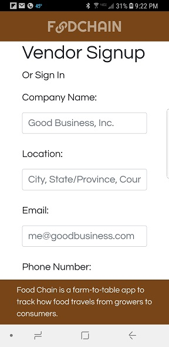
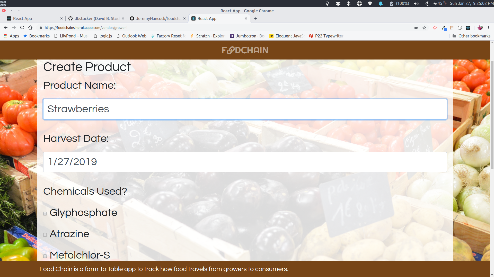
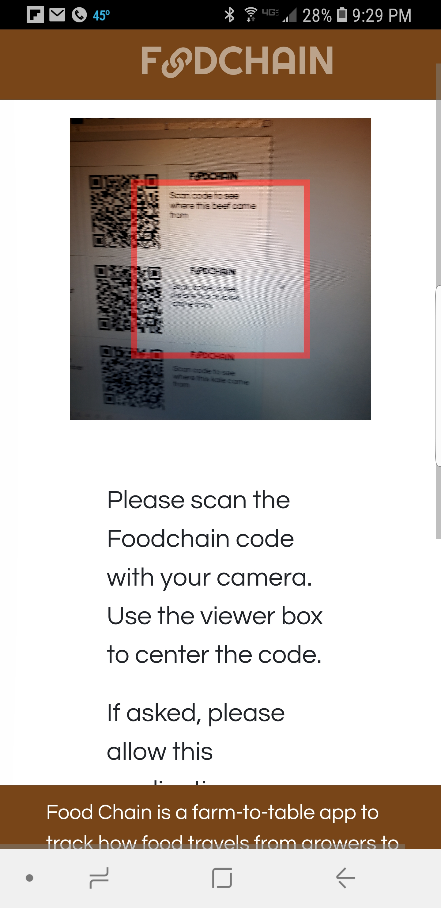
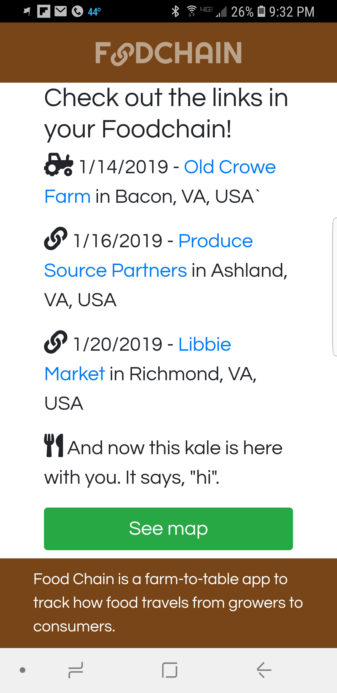
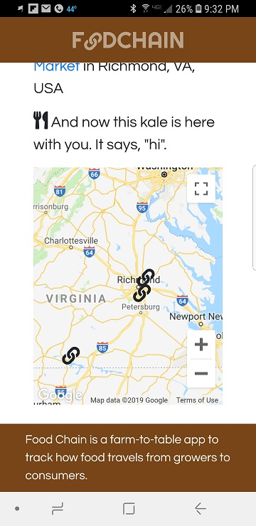

# FOODCHAIN
#### Food Chain is a farm-to-table app to track how food travels from growers to consumers.

## Authors
[Jeremy Hancock](https://github.com/JeremyHancock) and [David Stocker](https://github.com/dbstocker)

## Github
[https://github.com/JeremyHancock/foodchain](https://github.com/JeremyHancock/foodchain)

## Deployed Version
[https://foodchains.herokuapp.com/](https://foodchains.herokuapp.com/)

## Dependencies
See `/package.json` (server) and `/client/package.json` (cleint) for a list of dependencies. Do `yarn install` in "`/`" and "`/client`" to install dependencies.

## Usage
Sign up or sign in as either a Producer (farmer, food distributor or grocer) a Consumer (end user at a market). If you're a Consumer, you can continue as a guest.

### Producers
Farmers can create a new product at the time of harvest. They can indicate herbicides and pesticides used, whether a product is certified organic, harvest date, and also provide comments about the product. When finished, FOODCHAIN generates a QR code with the data entered. This is the beginning of the Food CHain. The link includes the product name, harvest date, and harvest location. The code is then saved and printed on a label to be included with the shipping invoice or manifest.

A Distributor scans an inocming product to generate a new link with a new QR code. The link contains scan date, distributor name, and location. This new link is added to all previous links.

At market, a Grocer, Chef, or Butcher scans incoming products to generate the final link in the Food Chain. The final link contains scan date, grocer name, and location. The link code can be printed and included on shelf tags, crates, or 'Daily Special' displays for the Consumer to scan.

### Consumers
Consumers can scan a product's shelf tag code with any smart phone with a QR code reader. The code points to the deployed version of FOODCHAIN, where the products origin and links will be displayed. The Consumer follow links to the Producer's, Distributors', and Grocer's websites. She or he can also access a map to display the locations of each link in a product's Food Chain.

