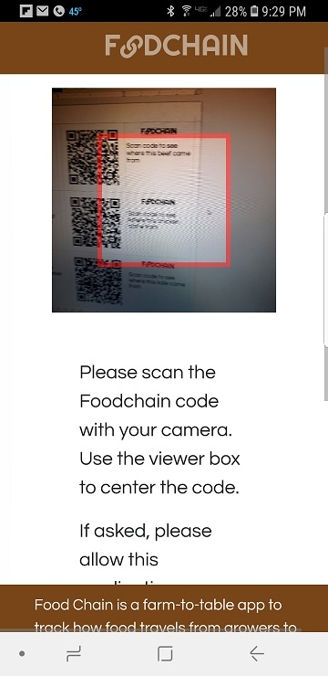
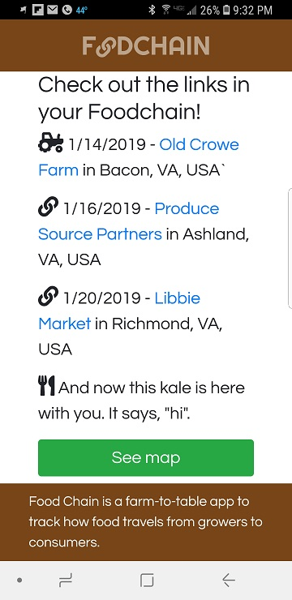

# FOODCHAIN
#### Food Chain is a farm-to-table app to track how food travels from growers to consumers.

## Authors
[Jeremy Hancock](https://github.com/JeremyHancock) and [David Stocker](https://github.com/dbstocker)

## Github
[https://github.com/JeremyHancock/foodchain](https://github.com/JeremyHancock/foodchain)

## Deployed Version
[https://foodchains.herokuapp.com/](https://foodchains.herokuapp.com/)

## Promotional Video

## Usage
Sign up or sign in as either a Producer (farmer, food distributor, or grocer) or a Consumer (end user at a market). If you're a Consumer, you can continue as a guest.

### Producers
Farmers can create a new product at the time of harvest. They can indicate herbicides and pesticides used, whether a product is certified organic, harvest date, and also provide comments about the product. When finished, FOODCHAIN generates a QR code with the data entered. This is the beginning of the Foodchain. The link includes the product name, harvest date, and harvest location. The code is then saved and printed on a label to be included with the shipping invoice or manifest.

### Links
A Distributor scans an incoming product to generate a new link with a new QR code. The new code adds the distributor's information and retains all the information previously associated with the product.

At market, a grocer, chef, or butcher scans incoming products to generate the final link in the Foodchain. The final link contains scan date, the grocer' name, and location, in addition to all prior information. The link code can be printed and included on shelf tags, crates, or 'Daily Special' displays for the Consumer to scan.

### Consumers
Consumers can scan a product's code with any smart phone's QR code reader. The code automatically takes them to the Foodchain website, where the product's Foodchain will be displayed. No login or navigation is required. The Consumer can dig further and follow links to the producer's, distributors', and grocer's websites. They can also access a map to display the location of each link in a product's Foodchain.

#### Technologies used
Written in Javascript (ES6), with some basic CSS and HTML, on a MERN stack (MySql, Express, React, Node). 
Foodchain utilized the following Node dependencies:
* [google-map-react](https://github.com/google-map-react/google-map-react)
* [react-qr-reader](https://github.com/JodusNodus/react-qr-reader)
* [react-qr-svg](https://github.com/no23reason/react-qr-svg)
* [save-svg-as-png](https://github.com/exupero/saveSvgAsPng)
* [react-geocode](https://github.com/shukerullah/react-geocode)

Thank you to the developers behind each of these packages for their hard work and willingness to share the results with the world.

#### Dependencies
See `/package.json` (server) and `/client/package.json` (client) for a list of dependencies. Do `yarn install` in "`/`" and "`/client`" to install dependencies for local hosting.